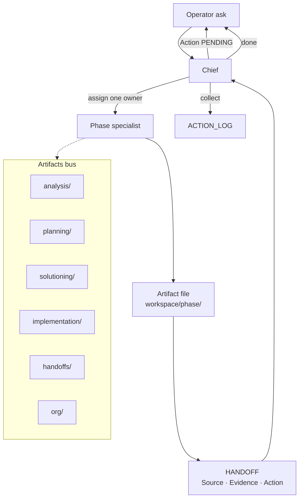

# Artifact bus — phases + HANDOFF loop

Chat is control. Files are the bus.

**Close needs:** Artifact path + HANDOFF with three gates. Chat-only handoffs are refused.

HTML (Archify): [artifact-bus.html](artifact-bus.html) when present.
