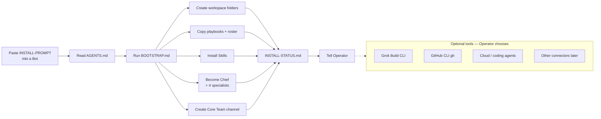

# Install flow — paste INSTALL-PROMPT → Bootstrap → Chief + specialists

Pasting [`INSTALL-PROMPT.md`](../../INSTALL-PROMPT.md) is the install trigger. A bare GitHub URL is not enough.

**Paste:** the block in [`INSTALL-PROMPT.md`](../../INSTALL-PROMPT.md)

**Order:** Become Chief, then CreateAgent Analyst → Product Manager → Architect → Developer. Do not CreateAgent a Chief.

Extended Bots are **not** created on first install.

Optional tools are **not** part of Core success. See [OPTIONAL-TOOLS.md](../OPTIONAL-TOOLS.md).

HTML (Archify): [install-flow.html](install-flow.html) when present.
