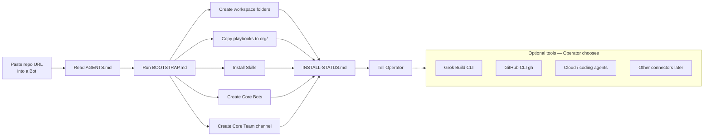

# Install flow — paste URL → Bootstrap → Bots / Skills / folders

Linking the repo is the install trigger.

**Paste-link:** `https://github.com/firmasite/bot-org-os`

**Order for Core Bots:** Chief → Analyst → Product Manager → Architect → Developer.

Extended Bots are **not** created on first install.

Optional tools are **not** part of Core success. See [OPTIONAL-TOOLS.md](../OPTIONAL-TOOLS.md).

HTML (Archify): [install-flow.html](install-flow.html) when present.
