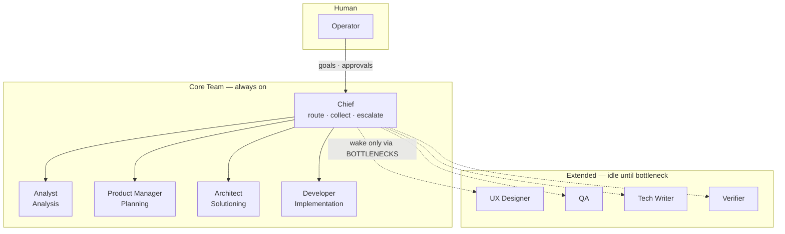

# Roster map — Core Team + Extended idle

Who is always on, and who waits for a bottleneck.

**Read this as:** Chief talks to you and routes work to one Core owner. Extended Bots stay documented but idle until pain is logged twice (or you assign explicitly).

HTML (Archify): [roster-map.html](roster-map.html) when present.
